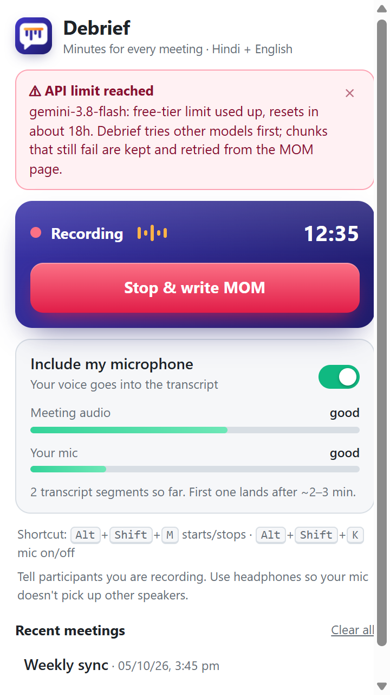
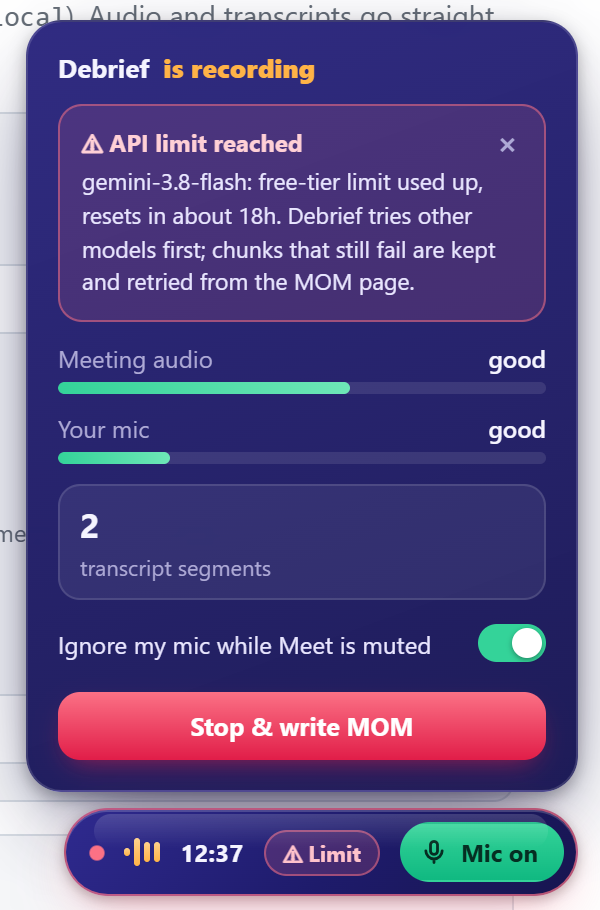

<div align="center">


# Debrief

**Minutes for every meeting, in Hindi, English and Hinglish.**

Records your Google Meet tab, transcribes it as people actually talk (code-switching and all), and writes clean Minutes of Meeting with action items. No backend, no subscription: it runs in your browser with your own API key, and the default setup is free.


<br>


&nbsp;&nbsp;&nbsp;


</div>

---

## Why it exists

Meeting notes in India are in Hinglish: Hindi sentences with English words in the middle, switching mid-sentence. Most transcribers mangle that. Debrief records the call, cuts the audio at natural pauses, and sends it to a model that handles code-switching, then turns the transcript into minutes you can paste straight into an email or a ticket.

## Features

| | |
|---|---|
| **One-click recording** | Start from the popup or press `Alt+Shift+M`. An amber dot on the icon reminds you when a Meet is open and not being recorded. |
| **Hinglish-aware transcription** | Hindi comes out in Devanagari, English words stay in English. Gemini, Sarvam, Deepgram or any Whisper-compatible server. |
| **Your mic, your call** | The on-page **pill** shows the recording and lets you include or ignore your mic with one click (`Alt+Shift+K`). It also **follows Meet's own mute button**, so side conversations while you're muted stay out of the transcript. |
| **Live health meters** | See meeting-audio and mic levels in the popup and the pill. If the recorder dies or the meeting is silent, you see it immediately instead of after the call. |
| **API limit alerts** | When a free-tier quota runs out or a key is rejected, the pill and popup turn red and Chrome shows a notification. Nothing is lost: failed audio is kept and retried. |
| **Quota-proof by design** | Free quotas are per model. Debrief falls back across several Gemini models and both of your keys before giving up. |
| **Noise-proof transcripts** | Looped filler that models invent on silent or noisy audio is detected and dropped. |
| **MOM your way** | Streams Markdown minutes: summary, decisions, action items table. Edit, copy, export `.md`, Word or PDF. Write in English or Hindi. |
| **Manage meetings** | Delete a single meeting or clear them all from the popup. |
| **Private** | Everything goes straight from Chrome to the provider you choose. No server of ours, ever. |

## Quick start

You need Chrome 116+ and Node.js (only to build).

```bash
git clone https://github.com/devshrawin/Debrief.git
cd Debrief
npm install
npm run build
```

1. Open `chrome://extensions`, switch on **Developer mode**, click **Load unpacked** and pick the `extension/` folder.
2. Open Debrief's **Settings**. Paste a free Gemini key from [aistudio.google.com/apikey](https://aistudio.google.com/apikey) (a second key from another Google Cloud project is optional but doubles your daily quota). Enter your name, click **Grant microphone** once, then **Save**.
3. Join a Meet. Click the Debrief icon, then **Start recording this tab** (or `Alt+Shift+M`). A small pill appears in the corner of the call.
4. When the meeting ends, hit **Stop & write MOM**. The MOM page opens and writes the minutes.

> Free-tier Gemini data may be used by Google and seen by reviewers. For confidential meetings, enable billing on the key or use a provider you trust.

## The pill

<div align="center">

</div>

- **Red dot + equalizer + timer**: recording, and audio is flowing. The bars go amber if no audio arrives.
- **Mic chip**: green `Mic on`, grey `Mic off`, amber `Muted` (Meet is muted, so Debrief is ignoring you). Click to flip.
- **Limit chip**: appears when an API limit or key problem hits. Hover or click the pill for the explanation and a dismiss button.
- Hover or click the pill for live meters, segment counts, the follow-Meet-mute switch and **Stop & write MOM**. Drag it anywhere; it remembers its place.

## How it works

```
popup / Alt+Shift+M ─► tabCapture stream id ─► offscreen document
                                                ├─ tab audio  (other participants) ─┐
                                                └─ microphone (you, optional)      ─┤
                                                  AudioWorklet → 16 kHz PCM         │
                                                  cut into chunks at pauses         │
                                                  silent chunks skipped             ▼
                                                STT: Gemini / Sarvam / Deepgram / Whisper
                                                            │ segments {t, me|others, text}
                                                            ▼
                                                service worker → chrome.storage.local
Meet tab pill ◄── state (levels, alerts, mic) ──┘
Stop ─► flush + wait ─► MOM page ─► LLM streams Markdown ─► copy / .md / Word / PDF
```

- Tab audio and mic are transcribed separately, so each line is tagged **you** or **others**. Remote speakers can't be told apart yet.
- Chunks are about 100 to 150 seconds on Gemini (fewer requests, better context) and under 30 seconds on Sarvam and Deepgram.
- Chunks that fail are stored in IndexedDB and retried automatically when you open the MOM page.

## Providers

| Stage | Options | Notes |
|---|---|---|
| Speech-to-text | **Google Gemini** `gemini-3.5-transcribe` (default) | Free key, code-switching aware. If it returns nothing or runs out of quota, general Gemini models take over. |
| | **Sarvam AI** `saaras:v4` | Best Hinglish accuracy. `codemix` mode writes Hindi in Devanagari and English in Latin. |
| | **Deepgram** `nova-3` (`language=multi`) | Hindi-English code-switching. |
| | **OpenAI-compatible Whisper** | Groq `whisper-large-v3`, OpenAI, or a local server such as `http://localhost:8000/v1`. |
| MOM writer | **Gemini** `gemini-3.8-flash` (default) | Same key as transcription. Falls back across other Gemini models on quota errors. |
| | **Claude** via `@anthropic-ai/sdk` | Default `claude-opus-5-5`, adaptive thinking. Sonnet 5.5 and Haiku 4.5 selectable. |
| | **OpenAI-compatible chat** | OpenAI, Groq, OpenRouter, Ollama, LM Studio. |

Custom base URLs ask for a host permission when you save settings.

## Free-tier quotas, honestly

Google's free tier limits requests **per model, per project, per day**, and a second key from the same project shares that limit. Debrief handles it in three layers:

1. It tries your chosen model, then **other models in turn** (each has its own quota), on both of your keys.
2. If everything is exhausted, audio is **kept** and retried later from the MOM page.
3. You get a **red alert** (pill, popup and a Chrome notification) saying which model ran out and roughly when it resets.

For heavy use, add a second key from a *different* Google Cloud project, or enable billing.

## Troubleshooting

| Symptom | What it means |
|---|---|
| Pill shows amber bars and "no audio data" | The recorder is not running. Stop and start again. |
| Meeting audio meter says *silent* | The Meet tab is muted or nobody is talking. Capture works per tab. |
| Mic meter says *silent* | Wrong input device, or Meet is muted and follow-mute is on. |
| Red "API limit reached" | A model's free quota is spent. Debrief keeps the audio. Wait, add a second project's key, or enable billing. |
| Red "API key rejected" | The key is invalid or lacks access. Re-paste it in Settings. |
| Weird repeated Hindi filler in old transcripts | Model noise on silent audio. Fixed in the current build (loop filter). |
| Pill missing | It only shows on the tab being recorded. Debrief injects it when recording starts; reload the Meet tab if you installed during a call. |

## Develop

```bash
npm run build          # bundle src/ into extension/dist/
npm run watch          # rebuild on change
node test/run.mjs      # unit tests: chunker, WAV, prompts, every provider on a mocked fetch,
                       # noise filter, alert classifier
node test/chrome-smoke.mjs   # loads the unpacked extension into headless Chrome and drives it
```

```
src/
  background.js   service worker: recording state, mic logic, alerts, notifications
  offscreen.js    audio capture, chunking, transcription pipeline
  chunker.js      pause-aware chunking + level meters
  stt.js          Gemini / Sarvam / Deepgram / Whisper clients, empty-reply and model fallback
  gemini.js       key + model fallback chain
  llm.js          MOM generation (Gemini / Claude / OpenAI-compatible), streaming
  noise.js        looped-filler detector
  alerts.js       quota / key error classifier
  pill.js         on-page Meet pill (content script)
  popup.js        popup UI
  mom.js          MOM page: transcript, generation, export
```

The manifest pins the extension ID (`nckojmcchehoejdfklcmllhpekagiddo`) with a `key`, so settings survive moving the folder.

## Caveats

- **Tell participants you are recording.** Your workspace admin may block extensions or tab capture.
- **Use headphones.** Otherwise your mic also hears the speakers and lines appear twice.
- Chrome allows one recording tab at a time. Closing it stops the recording and opens the MOM page.
- Muting in Meet does not mute Debrief's own mic stream; that is why the pill follows Meet's mute button. If Meet changes its page structure and the state can't be read, use the mic chip manually.
- No per-person speaker names yet for remote participants.

## Roadmap

- Speaker names from Meet's active-speaker indicator
- Auto-retry of kept chunks the moment quota resets
- One-click share of the MOM

---

<div align="center">

Built by <a href="https://github.com/devshrawin">@devshrawin</a>

</div>
